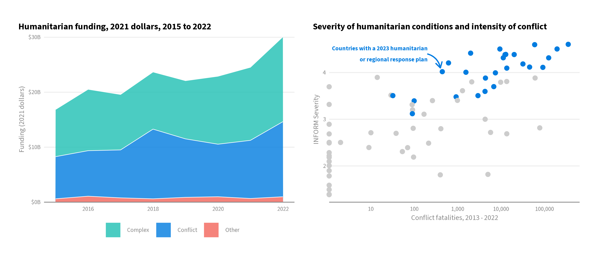

# Conflict Call to Action Paper

This is the codebase for generating plots used in our conflict call to action paper.
The code pulls in and wrangles data related to conflict events, humanitarian
severity of humanitarian conditions, and humanitarian funding flows and response
locations in `01_data_wrangling.R`. The wrangled data is stored in `data/`.

This wrangled data is then plotted in `02_plotting.R`, with the primary plot
stored in `plots/`, and an archive of previous plots in `plots/archive`.

## Plot



## Previous analysis

During exploration for the analysis, a number of other plots were explored,
stored in `plots/archive`.

1. `funding_real.png`: Humanitarian funding (actually provided for response) is
compared across time for crises that are driven entirely by conflict, complex
crises driven by conflict *and* other factors, and other crises driven by any
factors other than conflict.

2. `requirements_real.png`: The above plot, but using required (the appealed for
funding) instead of actual funding, since political considerations bias the
provision of humanitarian funding. However, results appear generally the same
across both plots.

3. `funding_pct.png`: The above plot, but looking at the proportion of yearly
funding going to each conflict type, showing the consistent funding of conflict
and complex crises taking up nearly all humanitarian funding.

4. `requirements_pct.png`: As above, using requirements to avoid potential bias,
although visualizations remain similar.

5. `inform_map.png`: Map of countries showing their INFORM Severity index in January
2022, with an overlay of all UCDP conflict incidents in 2021. Shows the quite clear
relationship between humanitarian conditions and conflict incidents.

6. `inform_conf_disp.png`: Scatter plot showing the relationship between a country's
humanitarian severity and the # of conflict events in that country, with the severity
of a country's displacement crisis coloring the points to highlight that high severity
countries with limited conflict are often impacted by conflict from other locations.

7. `pin_adm1.png`: Scatter plot showing the relationship between conflict and
% of population in need, measured at the 1st level administrative
boundaries across 14 countries.

8. `pin_iso3.png`: Scatter plot showing the relationship between conflict and
% of population in need, measured at the country level across 19 countries.

## Data wrangling

The data used in the analyses is described below. All datasets used in the final
plot are pulled in programmatically in the codebase. These are:

1. [UN OCHA Financial Tracking Services data](https://fts.unocha.org). The
FTS tracks reported to funding to humanitarian crises globally. For the analysis,
data on required funding (the full appeal for funds) and actual funding provided
is aggregated up across all countries from 1989 to 2023.

2. [UCDP Dataset Download Center](https://ucdp.uu.se/downloads/index.html). Data
on conflict events managed by the UCDP/PRIO Armed Conflict research program is
used for measuring conflict. Data is a set of geo-referenced events across time
with a range of other metadata.

3. [INFORM Severity Index](https://ucdp.uu.se/downloads/index.html). The severity
of humanitarian crises is measured by the INFORM Severity Index. The data includes
sub-measures of displacement severity and a list of key drivers of severity that is
also used to contextualize the crises.

### Previously explored datasets

During the exploration, a number of manually loaded datasets were used, as well as
additional dataset accessed via API. These were stored locally in the repository
under `input/`.

1. `geoBoundaries-AFG-ADM1_simplified.geojson`: 1st-level administrative boundaries
for Afghanistan, since the official country boundaries used by the UN are
not publicly available.
[Sourced from HDX](https://data.humdata.org/dataset/geoboundaries-admin-boundaries-for-afghanistan).

2. `afg_pcode_map.csv`: Manually created map between the `shapeID` column of the Afghanistan
shapefile and the PCODEs used by the UN.

3. `2022_sectoral_pins.csv`: Data on people in need in 2022 as estimated by
UN OCHA. The file is more granular and detailed than publicly available, and
thus cannot be shared publicly. The data for each country individually can
be sourced individually from [HDX](https://data.humdata.org/dataset).

4. [UN World Population Prospects](https://population.un.org/wpp/). The UN WPP
population estimates for 2022 were used to generate percent of populations in need
at the country-level in 2022.

## Reproducibility

The [renv](https://github.com/rstudio/renv) project environment manager for R
is used for package dependencies and reproducibility. When the project is opened
in RStudio, renv should automatically install itself. To match your project
environment to what was used for the analysis, simply run:

```r
renv::restore()
```

Refer to the renv documentation for more details.

### PiN data

The only non-publicly available data is on People in Need (PiN) from OCHA.
This file will likely not be shared even upon request due to its sensitivity,
but the analysis can be reroduced with your own PiN data file as long as long
as it has PiN data for countries with population data and PCODEs for subnational
data that can be matched to OCHA's [Common Operational Datasets](https://cod.unocha.org).


